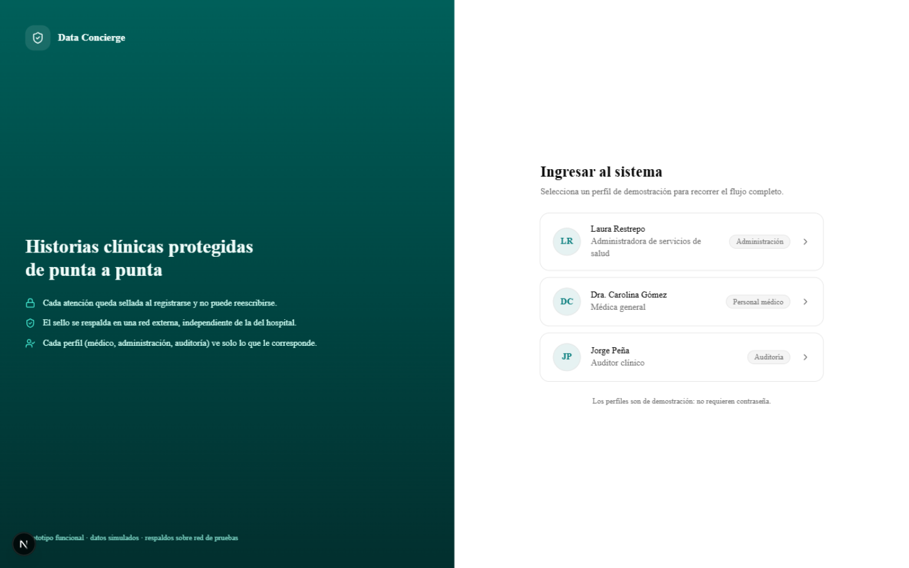
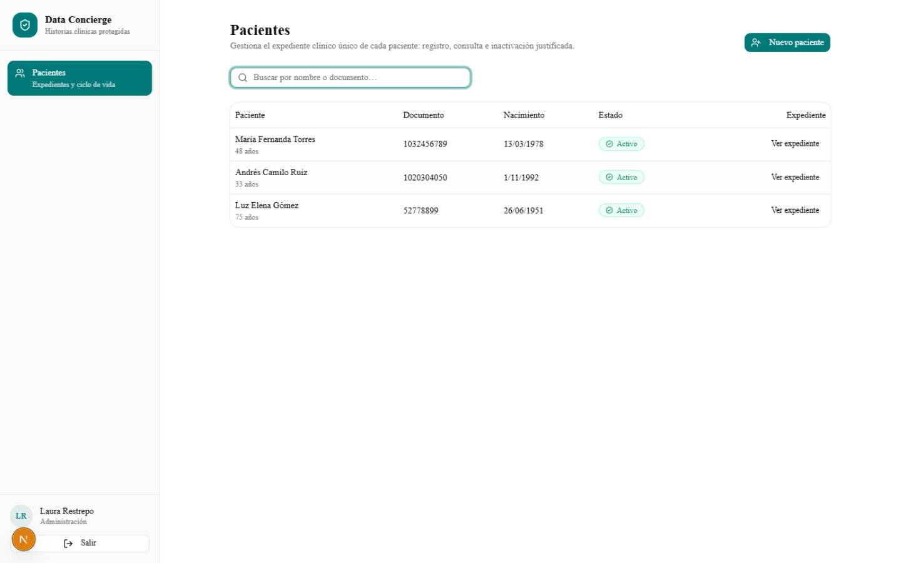
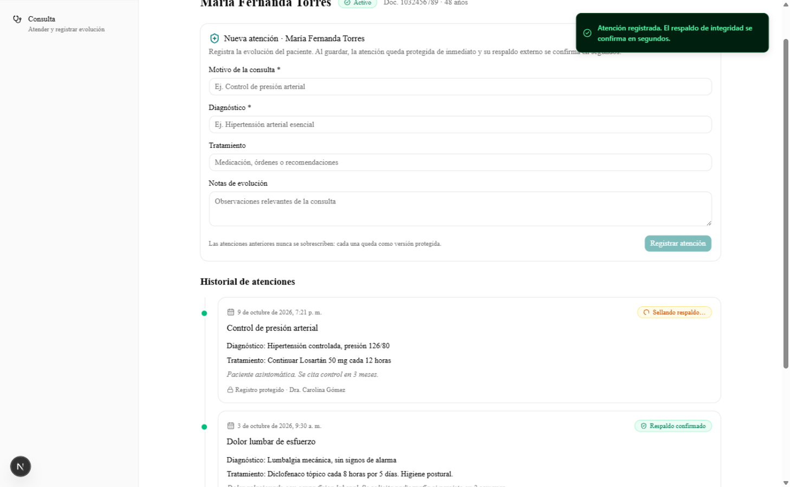
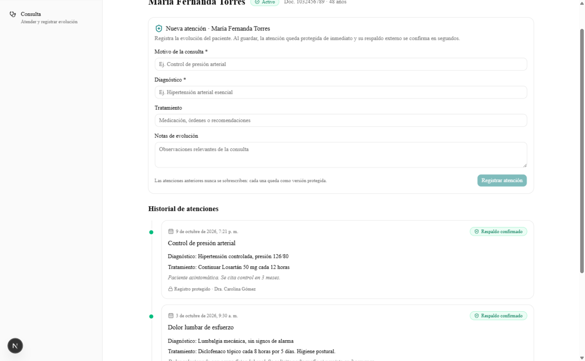
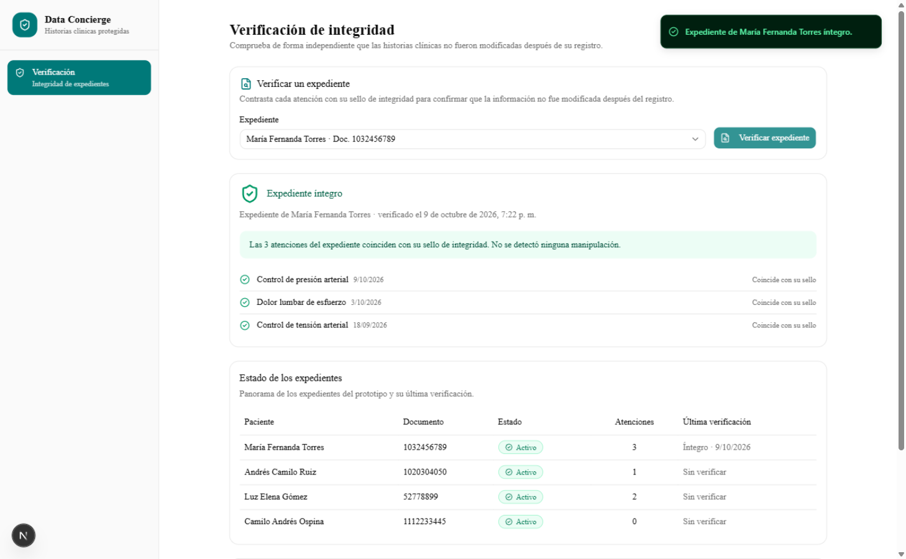
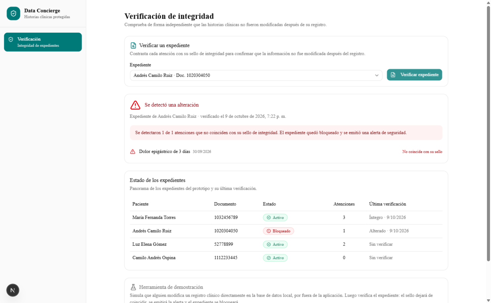
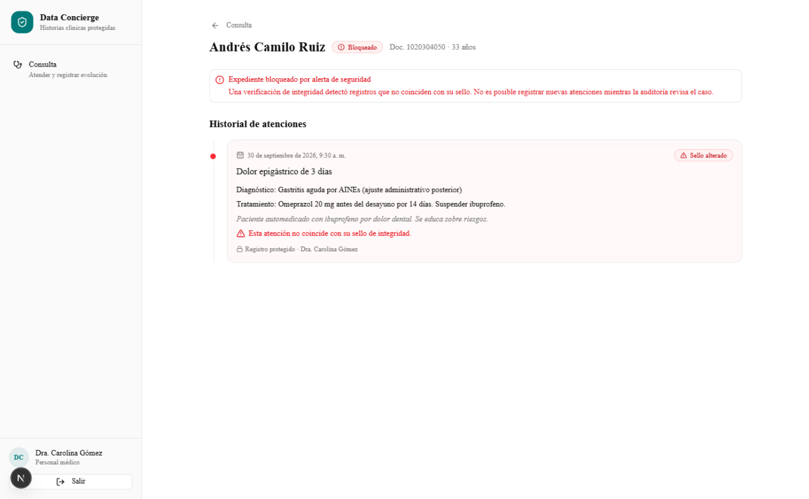

# Entregable 3 — Functional Proof (documentación grupal)

## 1. Front construido

El front es una aplicación web construida en **Next.js (App Router) + TypeScript**, con **Tailwind CSS y shadcn/ui** para la capa visual. Representa el flujo principal del MVP definido en el Product Blueprint: la gestión de expedientes clínicos con sello de integridad y respaldo externo, contada en lenguaje de usuario y sin exponer ningún concepto técnico de blockchain en la interfaz.

### Principio de diseño

Los usuarios del hospital (médico, administración y auditoría) no tienen por qué conocer hashes, redes ni contratos. Por eso toda la criptografía quedó escondida detrás de un único concepto comprensible: **el "sello de integridad"** de cada atención, con tres estados visibles: *"Sellando respaldo…"*, *"Respaldo confirmado"* y *"Sello alterado"*. El anclaje asíncrono del Blueprint (patrón Outbox) se representa con la transición entre los dos primeros estados: el médico registra la atención y la ve guardada de inmediato, y segundos después el badge pasa a confirmado sin que él espere nada.

### Pantallas implementadas

| Pantalla | Rol | Qué permite |
| --- | --- | --- |
| Ingreso (`/login`) | Todos | Selección de tres perfiles de demostración (uno por rol), sin contraseñas. |
| Pacientes (`/pacientes`) | Administración | Listado con búsqueda, registro de nuevos pacientes (validando documento único) y acceso al expediente. |
| Detalle de paciente (`/pacientes/[id]`) | Administración | Datos del paciente, historial de atenciones e **inactivación justificada** con motivo obligatorio; nunca se elimina información. |
| Consulta (`/consulta`) | Médico | Búsqueda del paciente del día y apertura de su expediente. |
| Expediente (`/expediente/[id]`) | Médico / Administración | Formulario de nueva atención y línea de tiempo del historial, con cada atención protegida en solo lectura. |
| Verificación (`/auditoria`) | Auditoría | Verificación de integridad del expediente, panorama de estados y herramienta de demostración de manipulación. |

### El flujo principal del MVP, paso a paso

1. **Administración** ingresa y registra un paciente: se abre su expediente clínico único con estado *Activo* (HU-01). La app valida que no exista otro paciente con el mismo documento.
2. **Médico** busca al paciente en Consulta y registra una nueva atención (motivo, diagnóstico, tratamiento y notas). La atención queda disponible al instante con el badge *"Sellando respaldo…"* y, a los pocos segundos, cambia a *"Respaldo confirmado"* (HU-02 y HU-06). Las atenciones anteriores nunca se sobrescriben: cada una es una versión protegida en la línea de tiempo.
3. Al tocar el badge confirmado se abre el **detalle del respaldo**: fecha de confirmación, identificador del respaldo y sello criptográfico del contenido, con enlace al explorador externo de la red de pruebas.
4. **Auditoría** verifica el expediente: la app recalcula el sello de cada atención y lo compara con el sello guardado al momento del registro. Si todo coincide, muestra *"Expediente íntegro"* con el detalle atención por atención (HU-04 y HU-07).

### Escenario de manipulación (el corazón de la propuesta de valor)

La pantalla de auditoría incluye una **herramienta de demostración** que simula exactamente la fricción del Problem Brief: alguien modifica un registro clínico directamente en la "base de datos local", por fuera de la aplicación. Al volver a verificar el expediente, el sello recalculado ya no coincide con el sello original. El sistema responde como está definido en el Blueprint: muestra la alerta *"Se detectó una alteración"* indicando cuántas atenciones fueron modificadas, **bloquea el expediente** y emite una notificación de seguridad. A partir de ese momento el médico ya no puede registrar atenciones en ese expediente y ve un aviso de bloqueo permanente.

### Arquitectura del front

El proyecto se organiza **por features** (autenticación, pacientes, atenciones y auditoría) y, dentro de cada una, **por capas** al estilo Clean Architecture solo front:

- `domain/`: entidades e interfaces de repositorio (el resto del código depende solo de estas interfaces).
- `data/`: implementaciones mock de los repositorios, que hoy persisten en el navegador (localStorage) y son las únicas que saben que no hay backend real.
- `viewmodel/`: hooks que exponen estado y acciones; es el "ViewModel" del patrón MVVM.
- `view/`: componentes visuales que solo renderizan lo que el viewmodel entrega.

Los datos son simulados: los repositorios mock imitan la asincronía de un backend real. El sello se calcula con **SHA-256 real** (Web Crypto del navegador) sobre una serialización estable del contenido, y un "sellador" en segundo plano confirma los respaldos pendientes, imitando el comportamiento del patrón Outbox. Este aislamiento es lo que permite, en la semana 4, sustituir los mocks por las llamadas reales a la red de pruebas de Stellar **sin tocar vistas ni viewmodels**.

La app incluye datos semilla (tres pacientes con atenciones ya confirmadas) para que la demo se pueda recorrer desde el primer segundo.

## 2. Decisión técnica

**Opción elegida: B — usar una herramienta existente del ecosistema de Stellar, sin contrato propio.**

En el Product Blueprint definimos que el uso de Stellar es de **anclaje de evidencias**: por cada atención médica se transmite únicamente un sello criptográfico opaco de 32 bytes (`EventHash`), sin ningún dato personal ni clínico, como prueba de existencia independiente. Para ese uso, el ecosistema de Stellar ya ofrece de forma nativa lo que necesitamos:

- **La operación `Manage Data`**: permite asociar entradas de datos clave-valor (hasta 64 bytes, suficiente para nuestro hash) directamente a las transacciones de una cuenta institucional. Es exactamente el mecanismo de "notaría digital" que el Blueprint describe.
- **La Horizon API y el explorador Stellar Expert**: para enviar las transacciones, consultar su confirmación y dejar evidencia pública consultable por auditores externos.

**Por qué descartamos la Opción A (contrato propio):** nuestro caso no necesita lógica en la red. No hay condiciones que evaluar, saldos que mover ni estados compartidos entre partes: solo se deja constancia inmutable de que un sello existía en un momento dado. Un contrato propio (por ejemplo en Soroban) añadiría desarrollo, despliegue, tarifas de ejecución, auditoría de seguridad y mantenimiento, sin aportar ninguna capacidad funcional adicional al caso de notarización. Además, `Manage Data` se confirma en segundos gracias al protocolo de consenso de Stellar y tiene un costo marginal por transacción, que encaja con el volumen de atenciones diarias de una institución.

La decisión quedó plasmada en la arquitectura del front: los repositorios mock están aislados en la capa de datos, de modo que en la semana 4 la implementación real (firma institucional, `Manage Data` y consulta en Horizon, todo sobre **testnet**) reemplazará a los mocks sin cambiar la experiencia de usuario.

## 3. Participación del equipo

| Integrante | Usuario de GitHub | Aporte en este entregable |
| --- | --- | --- |
| Daniel Zapata | *(completar usuario)* | Construcción del front en Next.js: arquitectura por features con MVVM, sesión por roles y pantallas de expediente con sellado simulado. |
| Cristian Díaz | *(completar usuario)* | Pantallas de administración de pacientes (registro, búsqueda e inactivación justificada) y revisión de la documentación. |
| Julián Galeano | *(completar usuario)* | Módulo de verificación de auditoría con el escenario de manipulación, y validación del flujo contra las historias de usuario del Blueprint. |

## 4. Bloqueos y siguiente paso

**Pendientes / bloqueos:**

- Los respaldos todavía son simulados: no hay conexión real con la red de pruebas de Stellar (es el alcance de la próxima semana).
- La autenticación es por perfiles de demostración, suficiente para el prototipo.
- Falta el despliegue en un hosting público (opcional, p. ej. Vercel) para compartir el enlace en el campo *Website* de Apex.

**Siguiente paso hacia el MVP:**

1. Implementar el anclaje real en **Stellar testnet**: sustituir los repositorios mock por una implementación que firme transacciones con la operación `Manage Data` y consulte confirmaciones vía Horizon, manteniendo la interfaz intacta.
2. Implementar la verificación dual real: contrastar el sello local contra la entrada anclada en la red.
3. Desplegar el front y registrar el enlace en Apex.
